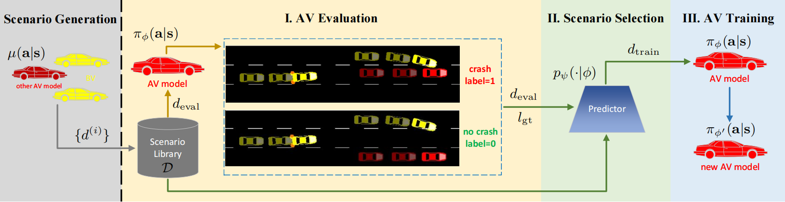

# CLIC



## Installation and Setups

Please ensure that you have installed `Python>=3.9` and `SUMO>=1.12.0`, then run the command to install the dependencies:

```
pip install -r requirements.txt
```

Add this repo directory to your `PYTHONPATH` environment variable:

```
export PYTHONPATH="$PYTHONPATH:$(pwd)"
```

## Run Experiments

Run the main training and testing experiment directly:

```
python run/main/main.py
```

Run in the background (can be monitored in real-time on the [Weights &amp; Biases webpage](https://wandb.ai/home)):

```
nohup python run/main/main.py &
```

## Citation

If you are using CLIC framework or code for your project development, please cite the following paper:

```
@article{niu2023continual,
  title={Continual Driving Policy Optimization with Closed-Loop Individualized Curricula},
  author={Niu, Haoyi and Xu, Yizhou and Jiang, Xingjian and Hu, Jianming},
  journal={arXiv preprint arXiv:2309.14209},
  year={2023}
}
```
