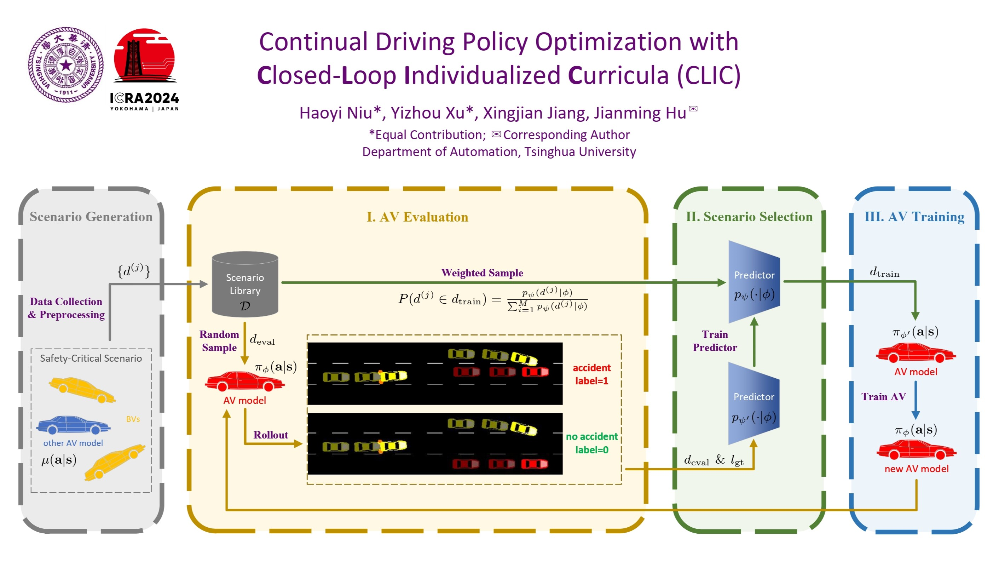

# CLIC

This is the repository of paper *Continual Driving Policy Optimization with **C**losed-**L**oop **I**ndividualized **C**urricula* (CLIC) ([https://arxiv.org/abs/2309.14209](https://arxiv.org/abs/2309.14209)). We develop a continual driving policy optimization framework which we factorize into a set of standardized sub-modules for flexible implementation choices: **AV Evaluation**, **Scenario Selection**, and **AV Training**. CLIC frames AV Evaluation as a collision prediction task, where it estimates the chance of AV failures in these scenarios at each iteration. Subsequently, by re-sampling from historical scenarios based on these failure probabilities, CLIC tailors individualized curricula for downstream training, aligning them with the evaluated capability of AV. Accordingly, CLIC not only maximizes the utilization of the vast pre-collected scenario library for closed-loop driving policy optimization but also facilitates AV improvement by individualizing its training with more challenging cases out of those poorly organized scenarios. This repository provides the codebase on which we benchmark CLIC and baselines in the scenario library generated by (Re)$^2$H2O([https://ieeexplore.ieee.org/document/10186559](https://ieeexplore.ieee.org/document/10186559)).



## Installation and Setups

Please ensure that you have installed `Python>=3.9` and `SUMO>=1.12.0`, then run the following command to clone this repository and install the dependencies:

```
git clone https://github.com/YizhouXu-THU/CLIC.git
cd CLIC
pip install -r requirements.txt
```

And add this repository directory to your `PYTHONPATH` environment variable:

```
export PYTHONPATH="$PYTHONPATH:$(pwd)"
```

## Run Experiments

Run the main training and testing experiment directly:

```
python run/main/main.py
```

And you can also try baselines by running `run/main/*.py`.

If you want to observe the real-time motion states of the vehicles through SUMO GUI, set parameter `sumo_gui=True`, and ensure your device has already installed SUMO GUI.

If you want to save the model parameters for each iteration during the training process, set parameter `save_model=True`.

## Visualization of Learning Curves

You can resort to [Weights &amp; Biases](https://wandb.ai/site) to login your personal account with your wandb API key.

```
export WANDB_API_KEY=YOUR_WANDB_API_KEY
```

and set parameter `use_wandb=True` to turn on the online syncronization.

## Citation

If you are using CLIC framework or code for your project development, please cite the following paper:

```
@article{niu2023continual,
  title={Continual Driving Policy Optimization with Closed-Loop Individualized Curricula},
  author={Niu, Haoyi and Xu, Yizhou and Jiang, Xingjian and Hu, Jianming},
  journal={arXiv preprint arXiv:2309.14209},
  year={2023}
}
```
